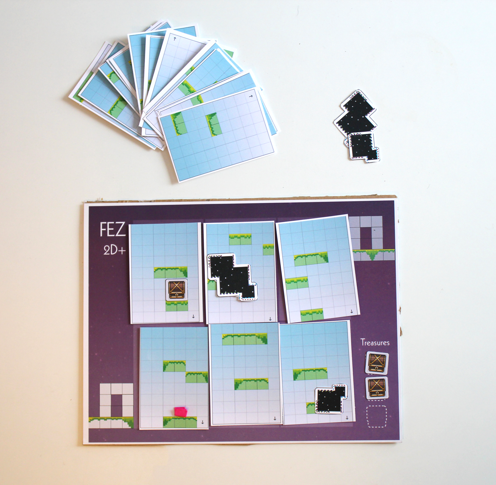
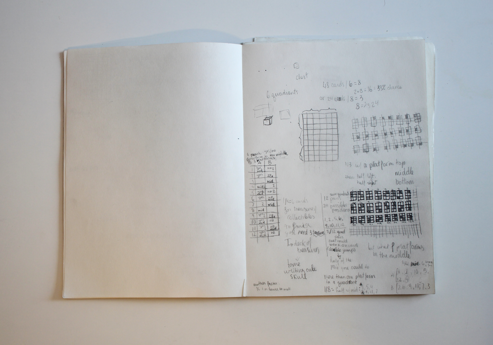

## Fez 2D+

Created with Roxolyana Shepko in one week  

  

[Download the game](../assets/fez2dplus/fez2dplus.pdf)    

### Rules

The board features two “doorways”, one on the bottom left corner of the board and one on the upper right corner of the board. The bottom left is the starting point, the top right is the finishing goal. The other goal is to collect chests.  

The player will randomly select 6 cards from a deck of 24 and place onto the indicated spaces upon the board. The player’s character must navigate the cards.  

The cards, once placed onto the spaces on the board, are not locked to their positions. They can be rearranged to figure out the ideal combination of placement to move the character across the board.

However, whichever card the character is on at that point during the game must remain locked in place.   
If the player is stuck and cannot progress, they can, once per round, discard one (1) card from the board and replace it by drawing another.  

The game lasts 3 rounds.  

At the beginning of every round, the player rolls a dice. The number they get is the number of the card they must place a chest on; they roll again to determine which platform they put it on. They do not prevent a card from being moved around, but they have to be moved with the card.   

At the beginning of round 2, the player uses this method to put a chest and a small black hole. Black holes are obstacles the player cannot collide with. Move black holes around like you would a chest.  

At round 3, place a chest, a small black hole, and a big black hole.

### On Balancing

Once we were set on making a platformer for paper, and we knew moving the cards around would allow us to give a similar feeling to when you are playing fez and you shift perspective, we knew we had to balance the possibility of platform placement. We needed to have platforms attainable or not on the same card and platforms well distributed across the different areas of the card - leaving the platform placement to randomness wouldn't have been as thorough.   

For this prototype, we played by ear and made 24 unique cards. 24 is a fun, easily divisible number in third and quarters, so it made sense. Separating the card of 9 by 6 squares into 6 sections, I distributed platforms evenly first left then right for each of the 3 rows, then added an even number of platforms in other rows, as well as left and right. The process could have been even more granular and take into account not only the quadrants but the lines of the platforms, and could be deepened through iterations and playtesting. Our class time playtest made me think the game was imbalanced as it is right now, as the deck only has 6 cards with platforms in the middle, so traversing the playing field can sometimes be impossible if dealt the wrong set of cards. The size of the board and total number of cards could also be tinkered with.

  

### The Influence and the Potential

So this Christmas I met my nieces, 9 and 7, whom both received many games for Christmas. One of them received a puzzle that resembles a full board of tetrominoes. It comes with a little booklet with a series of challenges, or levels, that are instructions on which tetrominoes to place where, the challenge being the player must fill out the rest of the grid with the remaining pieces. One could design levels for this game in the same way, setting immobile cards players must work around.  
In that sense, it also made me think about the game Labyrinth, with its map of both mobile and immobile terrain pieces that need to be moved around in order to reach the goal. Maybe Fez 2D+ too could be multiplayer, allowing only one card shuffling per person per turn. We steered away from multiplayer games however as my partner felt that the most important feeling she wanted to capture in this prototype is a chill experience of figuring out a puzzle at your own pace.

### Context and Fez Analysis

For Digital Games class at OCAD U, we were asked to do an MDA (Mechanics, Dynamics, Aesthetics) analysis of a game of our choosing, here Fez. This was an introductory way to think about the many layers that make a game. We were also told to answer some questions that make us think the game.  

After having a good grasp of that game, we were to translate it to a physical game, whether thematically, mechanically or literally.  

1. What is the point of the game?  
To explore everything, for which you need to acquire a mastery in navigating the 2d x 3d dimensions of the game levels

2. How do you play?  
By collecting the cubes, moving around 2dx3d level with the arrows and space bar or with a plugged controller and its buttons

3. How does gameplay feel?  
Exploratory and mysterious, not stressful, there is a sense of wonder, it doesn’t feel too challenging, you have this open space to explore but you can take your time, it feels very lively because of the cutesy style animation and the characters 

#### Mechanics: 
Running (arrow keys)
Jumping (space bar)
Looking around (up I, down K, left J, right L)
Changing perspective (A and D) 
Grab onto ledges (spacebar and up arrow key)
Talking to people (Shift) and to your fifth dimension cube companion
Collecting cubes
Opening chests
Collecting maps
Navigating through spaces, entering through doors
Reference maps

#### Dynamics: 
Challenge: navigating space in both 2d and 3d to attain spots on the map on the screen and in the world map that are no self-evident/ easy to go to (navigational puzzles) 
discovery, having multiple perspectives to shift to which changes the decor + going through doors that lead to new backgrounds and ambiance (get some screenshot)
narrative, both through written out dialog an animation that situates the player in the game overarching narrative and more insidiously through the different environment the player finds themselves into while playing the game
aspect of fellowship? Just in terms of online community / metagame; secrets and easter eggs are social

#### Aesthetics: 
challenge, 
discovery, 
narrative, 
aspect of fellowship? Just in terms of online community / metagame; secrets and easter eggs are social  
